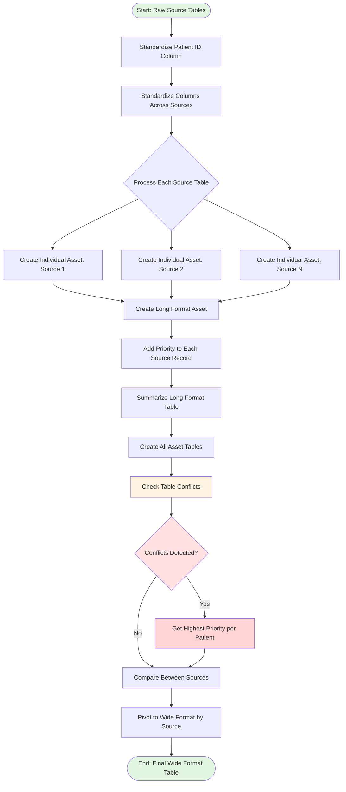

# Data Pipeline Flow Diagram

## Overview

This document describes the complete data curation pipeline for processing multi-source patient data, from raw database tables to analysis-ready datasets. The pipeline prioritizes data from multiple sources, resolves conflicts, and transforms data from long to wide format.

---

## Pipeline Architecture



---

## Detailed Pipeline Stages

### Stage 1: Data Standardization

#### 1.1 Standardize Patient ID Column
**Function:** `standardize_patient_id_column()`

**Purpose:** Ensure consistent patient identifiers across all source tables

**Input:**
```r
# Raw data with inconsistent column names
  ALF_PE  | WOB       | GNDR_CD
  1001    | 1950-05-15| M
  1002    | 1965-08-22| F
```

**Output:**
```r
# Standardized column name
  patient_id | date_of_birth | sex_code
  1001       | 1950-05-15    | M
  1002       | 1965-08-22    | F
```

**Code Location:** `r-scripts/pipeline_code/create_long_format_assets.R:27-41`

**Configuration:**
- Default standard name: `patient_id`
- Renames first column to standardized name
- Preserves all other columns

---

#### 1.2 Standardize Columns Across Sources
**Function:** Part of `create_long_format_asset()`

**Purpose:** Harmonize column names, data types, and formats across different data sources

**Actions:**
- Map source-specific column names to standard names (defined in YAML config)
- Convert data types (dates, numeric, character)
- Apply value mappings (e.g., "1" → "M", "2" → "F")
- Handle missing values consistently

**Example Mapping (from config.yaml):**
```yaml
date_of_birth:
  source_tables:
    - name: PATIENT_ALF_CLEANSED
      patient_id_col: ALF_PE
      select_columns:
        date_of_birth: WOB  # Raw column name → Standard name
      priority: 1

    - name: WDSD_BIRTH
      patient_id_col: ALF_PE
      select_columns:
        date_of_birth: BIRTH_DT
      priority: 2
```

---

### Stage 2: Asset Creation

#### 2.1 Create Individual Assets
**Function:** `create_long_format_asset()` (per source)

**Purpose:** Extract and process each source table independently with metadata

**Process:**
1. Read configuration for asset definition
2. Build SQL query for each source table
3. Execute DB2 query
4. Add source metadata (source_table, source_priority)
5. Standardize columns

**SQL Query Example:**
```sql
SELECT
    ALF_PE as patient_id,
    WOB as date_of_birth,
    RECORD_DATE as record_date,
    'gp_demographics' as source_table,
    1 as source_priority
FROM SAIL.WLGP_DEMOGRAPHICS
WHERE ALF_PE IN (1001, 1002, 1003, ...)
```

**Output per Source:**
```
patient_id | date_of_birth | record_date | source_table    | source_priority
1001       | 1950-05-15    | 2020-01-15  | gp_demographics | 1
1002       | 1965-08-22    | 2020-02-10  | gp_demographics | 1
```

**Code Location:** `r-scripts/pipeline_code/create_long_format_assets.R:43-218`

---

#### 2.2 Create Long Format Asset
**Function:** `create_long_format_asset()` (combined)

**Purpose:** Combine all sources into unified long format table

**Input:** Multiple source extracts (from Step 2.1)

**Output:** Single long format table with all sources
```
patient_id | source_table       | source_priority | date_of_birth | record_date
1001       | gp_demographics    | 1               | 1950-05-15    | 2020-01-15
1001       | hospital_admin     | 2               | 1950-05-15    | 2019-06-20
1002       | gp_demographics    | 1               | 1965-08-22    | 2020-02-10
1002       | hospital_admin     | 2               | 1965-08-20    | 2018-11-05  ← conflict
1003       | gp_demographics    | 1               | 1975-12-10    | 2020-01-01
```

**Key Features:**
- One row per patient per source
- Source metadata attached to each row
- Priority defined per source (lower number = higher priority)
- All sources preserved for comparison

**Code Location:** `r-scripts/pipeline_code/create_long_format_assets.R:43-218`

---

#### 2.3 Create All Asset Tables
**Function:** `create_all_asset_tables()`

**Purpose:** Batch process multiple assets in a single function call

**Usage:**
```r
assets <- c("date_of_birth", "sex", "ethnicity", "lsoa")

all_assets <- create_all_asset_tables(
  conn = conn,
  config = config,
  patient_ids = patient_ids,
  assets = assets,
  save_outputs = TRUE
)
```

**Output:** Named list of asset tables
```r
list(
  date_of_birth = <long format table>,
  sex = <long format table>,
  ethnicity = <long format table>,
  lsoa = <long format table>
)
```

**Code Location:** `r-scripts/pipeline_code/create_long_format_assets.R:262-283`

---

### Stage 3: Data Quality & Reconciliation

#### 3.1 Summarize Long Format Table
**Function:** `summarize_long_format_table()`

**Purpose:** Generate comprehensive statistics and data quality metrics

**Output:**
```
================================================================================
SUMMARY: date_of_birth Long Format Asset
================================================================================

OVERALL STATISTICS:
  Total rows: 15,000
  Unique patients: 10,000
  Number of sources: 3
  Date range: 2018-01-01 to 2024-12-31

--------------------------------------------------------------------------------
SOURCE BREAKDOWN:
--------------------------------------------------------------------------------

Source: gp_demographics (Priority: 1)
  Rows: 10,000
  Patients: 10,000
  Coverage: 100.0%
  Missing values: 0

Source: hospital_admin (Priority: 2)
  Rows: 4,500
  Patients: 4,500
  Coverage: 45.0%
  Missing values: 0

Source: emergency_dept (Priority: 3)
  Rows: 500
  Patients: 500
  Coverage: 5.0%
  Missing values: 0

--------------------------------------------------------------------------------
PATIENT COVERAGE ANALYSIS:
--------------------------------------------------------------------------------
  Patients with 1 source:  5,500 (55.0%)
  Patients with 2 sources: 4,000 (40.0%)
  Patients with 3 sources:   500 (5.0%)
  Patients with no data:       0 (0.0%)

Average sources per patient: 1.50
```

**Code Location:** `r-scripts/pipeline_code/create_long_format_assets.R:289-343`

---

#### 3.2 Check Conflicts
**Function:** `check_conflicts()`

**Purpose:** Identify discrepancies in values across sources for the same patient

**Algorithm:**
1. Group by patient_id
2. Count distinct values for key column (e.g., date_of_birth)
3. Flag patients with conflicting values
4. Report conflict details

**Example Conflicts Detected:**
```
patient_id | source_1           | value_1     | priority_1 | source_2        | value_2     | priority_2 | conflict
1002       | gp_demographics    | 1965-08-22  | 1          | hospital_admin  | 1965-08-20  | 2          | date_mismatch
1005       | gp_demographics    | M           | 1          | hospital_admin  | F           | 2          | sex_mismatch
```

**Output:**
```
================================================================================
CONFLICTS DETECTED: date_of_birth
================================================================================

Total patients with conflicts: 234 (2.34%)
Total patients analyzed: 10,000

CONFLICT BREAKDOWN:
  Date mismatches: 234
  High-priority conflicts (priority 1 vs 1): 0
  Medium-priority conflicts (priority 1 vs 2): 200
  Low-priority conflicts (priority 2 vs 3): 34

RECOMMENDATION: Review conflicts with priority 1 sources first
```

**Code Location:** `r-scripts/pipeline_code/create_long_format_assets.R:345-394`

---

### Stage 4: Resolution & Transformation

#### 4.1 Get Highest Priority per Patient
**Function:** `get_highest_priority_per_patient()`

**Purpose:** Resolve conflicts using priority hierarchy - select one row per patient

**Algorithm:**
```r
# 1. Group by patient_id
# 2. Arrange by source_priority (ascending)
# 3. Select first row (highest priority source)
```

**Input (Long Format - Multiple Rows per Patient):**
```
patient_id | source_table       | source_priority | date_of_birth | record_date
1001       | gp_demographics    | 1               | 1950-05-15    | 2020-01-15  ← selected
1001       | hospital_admin     | 2               | 1950-05-15    | 2019-06-20
1002       | gp_demographics    | 1               | 1965-08-22    | 2020-02-10  ← selected
1002       | hospital_admin     | 2               | 1965-08-20    | 2018-11-05
```

**Output (Wide Format - One Row per Patient):**
```
patient_id | date_of_birth | source_table    | source_priority | record_date
1001       | 1950-05-15    | gp_demographics | 1               | 2020-01-15
1002       | 1965-08-22    | gp_demographics | 1               | 2020-02-10
```

**Priority Resolution Rules:**
- Lower priority number = higher priority (1 > 2 > 3)
- Ties broken by record_date (most recent)
- Source metadata preserved for audit trail

**Code Location:** `r-scripts/pipeline_code/create_long_format_assets.R:396-409`

---

#### 4.2 Compare Between Sources
**Function:** `pivot_to_wide_by_source()` + manual comparison

**Purpose:** Analyze differences and generate reconciliation report

**Pivot to Wide Format:**
```r
wide_comparison <- pivot_to_wide_by_source(
  long_table = date_of_birth_long,
  value_columns = c("date_of_birth")
)
```

**Output (Wide Format by Source):**
```
patient_id | gp_demographics_dob | hospital_admin_dob | emergency_dept_dob | final_dob (priority)
1001       | 1950-05-15          | 1950-05-15         | NA                 | 1950-05-15
1002       | 1965-08-22          | 1965-08-20         | NA                 | 1965-08-22 ← conflict
1003       | 1975-12-10          | NA                 | NA                 | 1975-12-10
1004       | 1980-03-18          | 1980-03-18         | 1980-03-18         | 1980-03-18
```

**Comparison Analysis:**
```
================================================================================
CROSS-SOURCE COMPARISON REPORT
================================================================================

AGREEMENT ANALYSIS:
  Perfect agreement (all sources match): 8,500 patients (85.0%)
  Partial agreement (some sources match): 1,200 patients (12.0%)
  Complete disagreement (no sources match): 300 patients (3.0%)

SOURCE CONCORDANCE:
  gp_demographics vs hospital_admin: 95.2% agreement (4,500 compared)
  gp_demographics vs emergency_dept: 88.0% agreement (500 compared)
  hospital_admin vs emergency_dept: 92.0% agreement (200 compared)

DATA COMPLETENESS:
  gp_demographics: 10,000/10,000 (100.0%)
  hospital_admin: 4,500/10,000 (45.0%)
  emergency_dept: 500/10,000 (5.0%)

RECOMMENDATION:
  ✓ gp_demographics is most complete and reliable
  ⚠ Review 300 patients with complete disagreement
  ⚠ Manual validation recommended for high-stakes analyses
```

---

#### 4.3 Pivot to Wide Format by Source
**Function:** `pivot_to_wide_by_source()`

**Purpose:** Transform long format to wide format with one column per source (for comparison)

**Input (Long Format):**
```
patient_id | source_table       | date_of_birth
1001       | gp_demographics    | 1950-05-15
1001       | hospital_admin     | 1950-05-15
1002       | gp_demographics    | 1965-08-22
```

**Output (Wide Format by Source):**
```
patient_id | date_of_birth_gp_demographics | date_of_birth_hospital_admin
1001       | 1950-05-15                    | 1950-05-15
1002       | 1965-08-22                    | 1965-08-20
```

**Use Cases:**
- Side-by-side source comparison
- Discrepancy identification
- Data quality audits
- Manual validation workflows

**Code Location:** `r-scripts/pipeline_code/create_long_format_assets.R:485-502`

---

## Data Structures

### Long Format (Multi-Source)
**Description:** Multiple rows per patient, one per source

**Schema:**
```
patient_id      : integer/character (primary key component)
source_table    : character (primary key component)
source_priority : integer (1 = highest priority)
<asset_column>  : varies (e.g., date_of_birth, sex_code)
record_date     : date (optional - for temporal tracking)
```

**Example:**
```
patient_id | source_table       | source_priority | date_of_birth | record_date
1001       | gp_demographics    | 1               | 1950-05-15    | 2020-01-15
1001       | hospital_admin     | 2               | 1950-05-15    | 2019-06-20
1002       | gp_demographics    | 1               | 1965-08-22    | 2020-02-10
1002       | hospital_admin     | 2               | 1965-08-20    | 2018-11-05
```

**Advantages:**
- Preserves all source data
- Enables source comparison
- Facilitates conflict detection
- Audit trail for data lineage

---

### Wide Format (Priority Selected)
**Description:** One row per patient, highest priority source selected

**Schema:**
```
patient_id      : integer/character (primary key)
<asset_column>  : varies (e.g., date_of_birth, sex_code)
source_table    : character (metadata - which source was selected)
source_priority : integer (metadata - priority of selected source)
record_date     : date (optional - from selected source)
```

**Example:**
```
patient_id | date_of_birth | source_table    | source_priority | record_date
1001       | 1950-05-15    | gp_demographics | 1               | 2020-01-15
1002       | 1965-08-22    | gp_demographics | 1               | 2020-02-10
1003       | 1975-12-10    | gp_demographics | 1               | 2020-01-01
```

**Advantages:**
- Analysis-ready format
- One row per patient
- Conflicts resolved
- Clear data provenance

---

### Wide Format by Source (Comparison)
**Description:** One row per patient, separate column per source

**Schema:**
```
patient_id                    : integer/character (primary key)
<asset>_<source1>            : varies (e.g., date_of_birth_gp)
<asset>_<source2>            : varies (e.g., date_of_birth_hospital)
<asset>_<sourceN>            : varies
```

**Example:**
```
patient_id | dob_gp_demographics | dob_hospital_admin | dob_emergency_dept
1001       | 1950-05-15          | 1950-05-15         | NA
1002       | 1965-08-22          | 1965-08-20         | NA
1003       | 1975-12-10          | NA                 | NA
```

**Advantages:**
- Visual source comparison
- Easy discrepancy spotting
- Useful for data quality audits
- Supports manual review workflows

---

## Complete Pipeline Example

### Configuration (YAML)
```yaml
assets:
  date_of_birth:
    description: "Patient date of birth from multiple sources"
    source_tables:
      - name: SAIL.WLGP_DEMOGRAPHICS
        patient_id_col: ALF_PE
        select_columns:
          date_of_birth: WOB
          record_date: EXTRACT_DATE
        priority: 1

      - name: SAIL.PATIENT_ALF_CLEANSED
        patient_id_col: ALF_PE
        select_columns:
          date_of_birth: WOB
          record_date: AVAIL_FROM_DT
        priority: 2

      - name: SAIL.PEDW_EPISODE
        patient_id_col: ALF_PE
        select_columns:
          date_of_birth: WOB
          record_date: ADMIS_DT
        priority: 3
```

---

### R Code Workflow

```r
# ============================================================================
# COMPLETE DATA PIPELINE EXAMPLE
# ============================================================================

# Setup
library(DBI)
library(dplyr)
library(yaml)

# 1. Connect to database
conn <- connect_to_db2(
  dsn = "DB2_DSN",
  uid = Sys.getenv("DB2_USER"),
  pwd = Sys.getenv("DB2_PASSWORD")
)

# 2. Load configuration
config <- yaml::read_yaml("config/data_sources.yaml")

# 3. Define patient cohort
patient_ids <- c(1001, 1002, 1003, 1004, 1005)

# ----------------------------------------------------------------------------
# STAGE 1: CREATE LONG FORMAT ASSETS
# ----------------------------------------------------------------------------

# Create individual asset (single run)
dob_long <- create_long_format_asset(
  conn = conn,
  config = config,
  asset_name = "date_of_birth",
  patient_ids = patient_ids,
  save_outputs = TRUE,
  output_path = "data/long_format/"
)

# Or create multiple assets at once
all_assets <- create_all_asset_tables(
  conn = conn,
  config = config,
  patient_ids = patient_ids,
  assets = c("date_of_birth", "sex", "ethnicity", "lsoa"),
  save_outputs = TRUE
)

# ----------------------------------------------------------------------------
# STAGE 2: DATA QUALITY ASSESSMENT
# ----------------------------------------------------------------------------

# Summarize long format table
summary_stats <- summarize_long_format_table(
  long_table = dob_long,
  asset_name = "date_of_birth"
)

print(summary_stats$source_summary)
print(summary_stats$coverage)

# Check for conflicts
conflicts <- check_conflicts(
  long_table = dob_long,
  asset_name = "date_of_birth",
  key_column = "date_of_birth"
)

if (!is.null(conflicts)) {
  print("⚠ CONFLICTS DETECTED")
  print(conflicts)
}

# ----------------------------------------------------------------------------
# STAGE 3: RESOLVE CONFLICTS (PRIORITY-BASED)
# ----------------------------------------------------------------------------

# Get highest priority per patient (one row per patient)
dob_resolved <- get_highest_priority_per_patient(dob_long)

# Result: one row per patient
print(paste("Patients in long format:", nrow(dob_long)))
print(paste("Patients in resolved format:", nrow(dob_resolved)))

# ----------------------------------------------------------------------------
# STAGE 4: SOURCE COMPARISON (OPTIONAL)
# ----------------------------------------------------------------------------

# Pivot to wide format for side-by-side comparison
dob_comparison <- pivot_to_wide_by_source(
  long_table = dob_long,
  value_columns = c("date_of_birth")
)

# Review discrepancies
dob_comparison <- dob_comparison %>%
  mutate(
    agreement = case_when(
      date_of_birth_gp_demographics == date_of_birth_hospital_admin ~ "Match",
      is.na(date_of_birth_hospital_admin) ~ "Single source",
      TRUE ~ "Mismatch"
    )
  )

table(dob_comparison$agreement)

# ----------------------------------------------------------------------------
# STAGE 5: COMBINE ALL DEMOGRAPHICS
# ----------------------------------------------------------------------------

# Resolve each demographic asset
dob <- get_highest_priority_per_patient(all_assets$date_of_birth)
sex <- get_highest_priority_per_patient(all_assets$sex)
ethnicity <- get_highest_priority_per_patient(all_assets$ethnicity)
lsoa <- get_highest_priority_per_patient(all_assets$lsoa)

# Combine using left joins
demographics <- dob %>%
  select(patient_id, date_of_birth) %>%
  left_join(sex %>% select(patient_id, sex_code), by = "patient_id") %>%
  left_join(ethnicity %>% select(patient_id, ethnicity_code), by = "patient_id") %>%
  left_join(lsoa %>% select(patient_id, lsoa_code), by = "patient_id")

# Save to database
save_to_db(
  conn = conn,
  data = demographics,
  table_name = "DEMOGRAPHICS_COMBINED",
  schema = "DB2INST1",
  overwrite = TRUE
)

# ----------------------------------------------------------------------------
# CLEANUP
# ----------------------------------------------------------------------------

DBI::dbDisconnect(conn)
```

---

## Function Reference

| Function | Input | Output | Purpose |
|----------|-------|--------|---------|
| `standardize_patient_id_column()` | Data frame | Data frame | Rename first column to standard name |
| `create_long_format_asset()` | DB connection, config, asset name | Long format table | Extract from DB2 and combine sources |
| `create_all_asset_tables()` | DB connection, config, asset list | Named list | Batch create multiple assets |
| `summarize_long_format_table()` | Long format table | Summary list | Generate quality report |
| `check_conflicts()` | Long format table | Conflicts data frame | Identify conflicting values |
| `get_highest_priority_per_patient()` | Long format table | Wide format table | Select one row per patient by priority |
| `pivot_to_wide_by_source()` | Long format table | Wide format by source | Create source comparison table |

---

## Data Quality Metrics

### Key Quality Indicators

1. **Completeness**
   - Percentage of patients with data from each source
   - Percentage of patients with at least one source
   - Percentage of missing values per column

2. **Consistency**
   - Agreement rate between sources
   - Number of conflicts detected
   - Priority distribution of conflicts

3. **Coverage**
   - Number of sources per patient (distribution)
   - Patients with single vs. multiple sources
   - Source availability by patient subgroup

4. **Timeliness**
   - Most recent record date per source
   - Time lag between sources
   - Currency of data

---

## Processing Statistics

### Typical Data Volumes

| Stage | Patients | Rows | Columns | File Size |
|-------|----------|------|---------|-----------|
| Database extract | 10,000 | varies | varies | N/A |
| Demographics long format | 10,000 | 15,000 | 8 | 2 MB |
| Demographics resolved | 10,000 | 10,000 | 5 | 500 KB |
| Hospital admissions long | 10,000 | 500,000 | 8 | 40 MB |
| Primary care long | 10,000 | 2,000,000 | 8 | 160 MB |

### Processing Times

| Step | Duration | Bottleneck |
|------|----------|------------|
| Extract demographics (4 tables) | 2-3 min | DB2 query performance |
| Extract hospital admissions | 3-5 min | DB2 + data volume |
| Extract primary care | 5-8 min | DB2 + data volume |
| Combine demographics | <30 sec | In-memory joins |
| Check conflicts | 10-30 sec | Group by operations |
| Pivot to wide | 30-60 sec | Reshape operations |

---

## Database Storage

All intermediate tables are saved to **DB2INST1 schema** (workspace):

### Demographics Tables
- `DATE_OF_BIRTH_LONG_FORMAT`
- `SEX_LONG_FORMAT`
- `ETHNICITY_LONG_FORMAT`
- `LSOA_LONG_FORMAT`
- `DEMOGRAPHICS_COMBINED` (resolved)

### Clinical Tables
- `HOSPITAL_ADMISSIONS_LONG_FORMAT`
- `PRIMARY_CARE_LONG_FORMAT`
- `PRIMARY_CARE_MEDICINES_LONG_FORMAT`
- `DEATHS_LONG_FORMAT`

### Analysis Tables
- `STUDY_COHORT` (filtered demographics)
- `COHORT_WITH_COVARIATES` (baseline characteristics)
- `COHORT_WITH_OUTCOMES` (follow-up events)
- `FINAL_ANALYSIS_DATASET` (complete dataset)

**Access Pattern:**
```r
# Read from database
demographics <- read_from_db(conn, "DEMOGRAPHICS_COMBINED", schema = "DB2INST1")

# Save to database
save_to_db(conn, demographics, "DEMOGRAPHICS_COMBINED", schema = "DB2INST1")
```

---

## Code Location Reference

| Component | File | Lines |
|-----------|------|-------|
| `standardize_patient_id_column()` | `r-scripts/pipeline_code/create_long_format_assets.R` | 27-41 |
| `create_long_format_asset()` | `r-scripts/pipeline_code/create_long_format_assets.R` | 43-218 |
| `create_all_asset_tables()` | `r-scripts/pipeline_code/create_long_format_assets.R` | 262-283 |
| `summarize_long_format_table()` | `r-scripts/pipeline_code/create_long_format_assets.R` | 289-343 |
| `check_conflicts()` | `r-scripts/pipeline_code/create_long_format_assets.R` | 345-394 |
| `get_highest_priority_per_patient()` | `r-scripts/pipeline_code/create_long_format_assets.R` | 396-409 |
| `pivot_to_wide_by_source()` | `r-scripts/pipeline_code/create_long_format_assets.R` | 485-502 |
| Database utilities | `r-scripts/utility_code/db_table_utils.R` | 1-367 |

---

## Related Documentation

- **Pipeline Flow Documentation:** `documentation/PIPELINE_FLOW_DOCUMENTATION.md`
- **Function Quick Reference:** `documentation/FUNCTION_QUICK_REFERENCE.md`
- **Visual Diagram (ASCII):** `documentation/PIPELINE_VISUAL_DIAGRAM.txt`
- **Database Storage Guide:** `r-scripts/docs/DATABASE_STORAGE.md`
- **Examples Index:** `r-scripts/examples_code/INDEX.md`

---

## Best Practices

### Data Quality
1. Always run `summarize_long_format_table()` before resolving conflicts
2. Review `check_conflicts()` output for high-priority conflicts
3. Use `pivot_to_wide_by_source()` for manual validation of critical patients
4. Document priority decisions in configuration file

### Performance
1. Limit patient_ids in testing to reduce DB2 query time
2. Use `save_outputs = TRUE` to cache long format tables
3. Process demographics separately from clinical data
4. Use database storage for large intermediate tables

### Reproducibility
1. Version control all configuration files
2. Document priority assignments and rationale
3. Save metadata with each table (source, date, version)
4. Keep audit trail of conflict resolution decisions

---

## Glossary

- **Long Format:** Multiple rows per patient (one per source)
- **Wide Format:** One row per patient (conflicts resolved)
- **Source Priority:** Numeric ranking of data sources (1 = highest)
- **Asset:** A specific data element tracked across sources (e.g., date_of_birth)
- **Conflict:** Disagreement in values across sources for same patient
- **Coverage:** Percentage of patients with data from a given source
- **Agreement:** Percentage of patients where sources provide identical values

---

**Document Version:** 1.0
**Last Updated:** 2025-10-28
**Pipeline Version:** 3.0 (Database-based storage)
